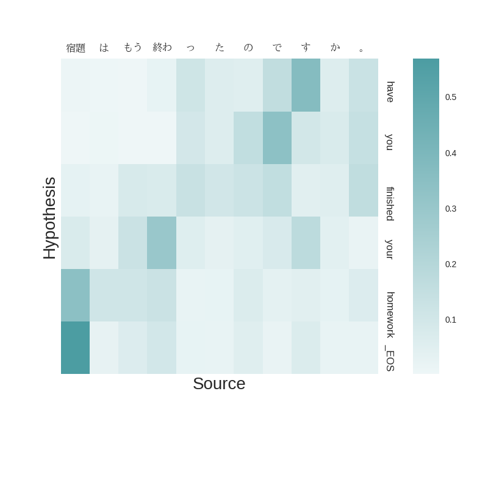

<div class="alert alert-info">
This assignment is due at 16:00 GMT on 13 March, 2017. Late submissions will
receive a mark of zero, under the 
<a href="http://web.inf.ed.ac.uk/infweb/student-services/ito/admin/coursework-projects/late-coursework-extension-requests">Informatics late policy</a>.
An assignment submitted at 16:01 GMT on 13 March is considered late.

Before you start, please read this page carefully. Submissions that do not
follow the Ground Rules (at the bottom of the page)
will receive a mark of zero.
</div>

Neural machine translation <small>| Coursework 2</small>
--------------------------------------------------------

We have looked at a variety of probabilistic models of translation. Neural
machine translation models are the latest in a long line of such models. 
Notwithstanding any hype you may have heard about them,
they are still fundamentally probabilistic models of discrete input and output
sequences. However, they differ from previous generations of probabilistic 
translation models in some important ways.

1. Rather than work with discrete distributions directly parameterized as tables of real numbers, 
   conditional distributions are created by first using a function to _encode_ the 
   discrete input sequence into a vector of continuous values (real numbers). Output 
   is then _decoded_ by sampling from a probability distribution that is 
   constructed as a function of this continuous vector.    

1. The encoder and decoder are simply functions composed from
   simple matrix operations like addition, multiplication, and pointwise 
   transformations such as tanh, exponentiation, and scalar division. For example, the _softmax_
   operation converts any vector to a probability distribution by exponentiating every element,
   summing the result, and pointwise dividing the exponentiated elements by the sum.

1. These functions are parameterized by matrices,
   which can be learned using gradient-based optimization algorithms.[^adam] The gradients
   are computed by differentiating the composed functions using the 
   [chain rule for derivatives](https://en.wikipedia.org/wiki/Chain_rule) 
   (aka [backpropagation](https://colah.github.io/posts/2015-08-Backprop/)). 
   This is quite easy to automate, so instead of computing the gradients by hand after
   defining the model, we use software libraries for automatic differentiation.[^autodiff]
   This means that the translation function is implemented declaratively, and much of the difficult 
   work is performed by libraries. The entire function is specified, and then it is
   learned _end-to-end_: all parameters are trained simultaneously using a single algorithm.
   This is quite different from phrase-based models, in which a sequence of separate models
   are trained individually and then combined into a final model, which must also be trained.

[^adam]: The current favored optimizer is the excellently named [Adam](https://arxiv.org/abs/1412.6980).

[^autodiff]: This may seem obvious in 2017. But less than a decade ago, automatic differentiation 
      was so uncommon in machine learning that one researcher called it 
      [the most criminally underused tool in the potential machine learning toolbox](https://justindomke.wordpress.com/2009/02/17/automatic-differentiation-the-most-criminally-underused-tool-in-the-potential-machine-learning-toolbox/)

Your task is to implement a neural machine translation pipeline by
extending a simple baseline model, closely related to the neural language
model you worked with in [lab 2](https://github.com/INFR11133/lab2). In
each part of the coursework you will be asked to implement a different
extension.

<div class="alert alert-danger">
<b>IMPORTANT</b>: Each extension will require you to train a completely new neural
machine translation model from scratch. While implementing these changes 
may only take you a few minutes
or hours, training the new models will take you <b>A LONG TIME</b>. You might 
implement something in thirty minutes and leave it to train overnight. 
Imagine that you return the next morning to find it has a bug! If the next
morning is the due date, then you'll be in a pickle, but if it's a week before
the due date, you have time to recover. So, if you
want to complete this coursework on time, start early. I will not take pity on you
if you start too late.
</div>


Getting started [30 marks]
--------------------------

If you haven't yet completed [lab 2](https://github.com/INFR11133/lab2), 
you should do so now. Don't simply click through the notebook: familiarize
yourself with the code and make sure you understand what it does. This 
coursework uses similar code, and also relies on the same environment
`mtenv` that you set up for lab 2, so pay particular attention to the setup
instructions in the [readme](https://github.com/INFR11133/lab2/blob/master/README.md).


Get the code.

    git clone https://github.com/INFR11133/hw2.git

You'll find a directory `data` containing English and
Japanese parallel data (from [a tutorial](https://github.com/neubig/nmt-tips) that you may find helpful), 
a `model` directory containing a pretrained 
Japanese-to-English neural translation model, and three python files:

1. `nmt_config.py` contains configuration parameters, some of which you will 
   be asked to experiment with. In particular, pay close attention
   to the model and training parameters towards the end of the file. You may also
   adjust the `gpuid` parameter if you have access to a GPU, which will make 
   training times faster (but they will still take considerable time to train, 
   so you should give yourself plenty of time even if you have a GPU).

1. `nmt_translate.py` trains a translation model (if one is not already present)
   and translates test sentences. You will not need to modify this script.

2. `enc_dec.py` contains a simple translation model, specified using the
   [chainer](http://docs.chainer.org/en/latest/) library used in lab 2. You will
   need to understand and modify this code as instructed below in order to 
   complete the coursework. Doing so should give you a good idea of how a neural
   machine translation system works, at a level of detail that you can't get
   from lectures or reading.
   

    cd translate
    source activate mtenv
    
    ipython
    In [1]: %run nmt_translate.py

You should see a message indicating that a pre-trained model has been loaded.
To translate using this model, do:

    In [2]: _ = predict(s=10000, num=10)

This displays translations of the first 10 japanese sentences of the dev set.
To view predictions on training set do:

    In [3]: _ = predict(s=0, num=10)

Most of these translations will be poor. To find better translations 
from this model, we can add filters based on precision and recall of 
each translation with respect to a reference translation.
The following statement will only display predictions with ```recall >= 0.5```

    In [4]: _ = predict(s=10000, num=10, r_filt=.5)  

The following statement will only display predictions with ```precision >= 0.5```

    In [5]: _ = predict(s=10000, num=10, p_filt=.5)

This model is still quite basic and trained on a small dataset, so the 
quality of translations is poor. Your goal will be to see if you can
improve it.

The current implementation in `enc_dec.py` encodes the sentence using a 
bidirectional LSTM: one passing over the input sentence from left-to-right,
the other from right-to-left. The final states of these LSTMs are 
concatenated and fed into the decoder, an LSTM that generates the output
sentence from left-to-right. The _encoder_ is essentially the same as the encoder
described in Section 3.2 of the [2014 paper](https://arxiv.org/pdf/1409.0473.pdf)
that now forms the basis of most current neural MT models. The _decoder_
is simpler than the one in the paper (it doesn't include the context vector
described in Section 3.1), but you'll fix that in Part 3.

Before we go deeply into modifications to the translation model, it is 
important to understand the baseline implementation, the data we run it on, and
some of the techniques that are used to make the model run on this data.

__Q1. [10 marks]__ The file `enc_dec.py` contains explanatory comments
to step you through the code. Five of these comments are missing, but they
are easy to find: search for the string `__QUESTION` in the file. For each
of these cases, please (1) add explanatory comments to the code, and (2)
copy your comments to your answer file. If you aren't certain what a 
a particular function does, refer to the [chainer documentation](http://docs.chainer.org/en/latest/).
(However, explain the code in terms of its effect on the MT model; don't
simply copy and paste function descriptions from the documentation).
 
In preparing the training data, word types that appear only once are 
replaced by a special token, _UNK. This prevents the vocabulary from 
growing out of hand, and enables the model to handle unknown words in new 
test sentences (which may be addressed by postprocessing). But what 
effect does this replacement have on the properties of our language data?

__Q2. [10 marks]__ Examine the parallel data and answer the following questions.

1. Plot the distribution of sentence lengths in the English and 
   Japanese and there corrletion. What do you infer from this about 
   translating between these languages? 
1. How many word tokens are in the English data? In the Japanese?
1. How many word types are in the English data? In the Japanese data?
1. How many word tokens will be replaced by _UNK in English? In Japanese?
1. Given the observations above, how do you think the NMT system will
   be affected by differences in sentence length, type/ token ratios,
   and unknown word handling? 

__Q3. [10 marks]__
What language phenomena might affect the severity of these effects?
Any claims you make must be supported by _evidence_, in the
form of statistics, known facts about language, and/ or examples.
Unsupported answers will receive a mark of zero!

In answering question 3, you may find it useful to refer to 
[The world atlas of language structures](http://wals.info/).

Part 2: Exploring the model [30 marks]
--------------------------------------

Let's first explore the decoder. It makes predictions one word at a time
from left-to-right, as you can see by examining the function `decoder_predict`
in the file `enc_dec.py`. Prediction works by first computing a distribution
over all possible words conditioned on the input sentence. We then choose
the most probable word, output it, add it to the conditioning context, and
repeat until the predicted word is an end-of-sentence token (`_EOS`).

__Q4. [10 marks]__ Modify the ```select_word``` function in the decoder to _sample_ from the probability 
distribution at each time step, rather than returning the most probable word
(this is a one-line change). Then sample a few translations for the dev data.
These are alternatives to the one the decoder chooses. 

1. What conclusions can you draw about the translation model based on this
   sample? Remember to support your claims with _examples_.
1. Return the decoder to its original state of  always choosing the 
   maximum-probability word at each
   time step. This is a greedy decoder. How would you modify this decoder
   to do beam search---that is, to consider multiple possible translations
   at each time step---as you did for a phrase-based decoder in 
   [coursework 1](http://www.inf.ed.ac.uk/teaching/courses/mt/hw1.html).
   __NOTE__: You needn't implement beam search. The purpose of this 
   question is simply for you to think through and clearly explain how
   you would do it.
1. Could you implement dynamic programming for this model? Why or why not?
   Again, you needn't implement this.

The next two questions ask you to modify the model and retrain it. 
Implementing the modifications will not take you very long, but retraining 
the model will. 

__NOTE__. I recommend that test your modifications by retraining
on a small subset of the data (e.g. a thousand sentences). To do that, you should change the ```USE_ALL_DATA``` setting in ```nmt_config.py``` file to False. The results  will not be very good; your goal is simply to confirm that the change does not break the code and that it appears to behave sensibly. This is simply a sanity check, and a useful time-saving engineering test when
you're working with computationally expensive models like neural MT.
For your final models, you should train on the entire training set.

__Q5. [10 marks]__ Experiment with _one_ of the following changes to the
model, and explain how it affects the perplexity, BLEU, 
and the actual translations your system produces, compared to the baseline
model you were given. (In explaining the changes, be sure
to include _examples_). Your answer should precisely specify how you
changed the model---for example, if you change the number of layers,
state the number you used.

1. Change the number of layers in the encoder, decoder, or both.
1. Change the number of hidden units by a substantial amount (e.g.
   by halving or doubling the number, not adding or subtracting one).

To train a new model, you have to modify ```nmt_config.py``` with your 
required settings - the number of layers you wish to use, layer width, 
number of epochs and a name for your experiment.

As an example, let's define a new model with the size of hidden units in the 
LSTM(s) as 100, and 2 layers for both the encoder and the decoder:

    # number of LSTM layers for encoder
    num_layers_enc = 2
    # number of LSTM layers for decoder
    num_layers_dec = 2
    # number of hidden units per LSTM
    # both encoder, decoder are similarly structured
    hidden_units = 100

And set the number of epochs equal 1 or more (otherwise the model will not train):

    # Training EPOCHS
    NUM_EPOCHS = 10

To start training a model with updated parameters execute the bash script:

    ./run_exp.bat 

After each epoch, the model file is saved to disk. The model file name 
includes the parameters used for training. As an example, with the above 
settings, the model and the log file names will be:

    model/seq2seq_10000sen_2-2layers_100units_{EXP_NAME}_NO_ATTN.model
    model/train_10000sen_2-2layers_100units_{EXP_NAME}_NO_ATTN.log

__Q6. [10 marks]__ An important but simple technique for working with
neural models is _dropout_, which must be applied in a particular way
to our model. Implement the method of dropout described in 
[this paper](https://arxiv.org/pdf/1409.2329.pdf). This change should
require no more than one or two lines, but will test your understanding
of the code (because you need to identify where it should go). 
Retrain you model. How does dropout affect the results, compared to the
baseline? As in the previous question, your answer should explain the
changes to perplexity, BLEU, and the translations themselves. You should
also explain where you added dropout to the code and what parameters you
used for it.

Part 3: Attention [40 marks]
----------------------------

The last change you will implement is to augment the encoder-decoder with 
an attention mechanism. For this, we expect you to use a very simple model
of attention, _global attention with dot product_, as described in
[this paper](http://www.aclweb.org/anthology/D15-1166). This is the simplest
model of attention, and reasonably effective in many settings. As a practical
matter, at each time step it requires you to take the dot product of the
decoder hidden state with the hidden state of each input word (itself the 
concatentation of forward and backward encoder LSTM hidden states). The
results should be passed through the _softmax_ function (i.e. exponentiated 
and normalized) and the resulting distribution should be used to interpolate
the input hidden states to produce a context vector used as additional
input to the decoder.

__Q7. [20 marks]__ Implement the attention model described above.

__Q8. [10 marks]__ Retrain your decoder, and again explain how the change
affects results compared to the baseline in terms of perplexity, BLEU, and
the actual translations. 

__Q9. [10 marks]__ Visualize the evolution of the attention vectors for
five decoded sentences, using the provided code. Do they seem reasonable?
Why or why not?
Base your argument in evidence from the data. You'll need to understand the 
Japanese words to do this effectively (use Google Translate).

We provide a function, ```plot_attention``` to plot attention vectors. 
A plot will be generated and stored in the model directory. To do this 
set ```plot=True``` in the ```predict``` function.

    _ = predict(s=10000, num=1, plot=True)


This will output a heatmap of the attention vectors and save the plot 
as ```lamtran_ja_en_data_10500/sample_10000_plot.png```



Possible Extensions
-------------------

Neural machine translation is an extremely active area of research, and this
coursework has only introduced the basic ideas. Now that you have a working
encoder-decoder model with attention, you may want to experiment with it further.
Here are some ideas.

Minibatches
: In lab 2 we arbitrarily picked 32 characters to be the length of the sequences we feed 
  into the model during training. In the current task, however, we are not free to do 
  so. The sequence length is fixed for each example and equals to the length of the 
  source sentence plus the length of the translation plus one (for the end-of-sentence 
  symbol). The sentences in our corpus are not of equal lengths, and therefore the 
  length of the input sequences is variable. Variable-length input is, in theory, not a 
  problem for a recurrent neural network, and both the encoder and the decoder are RNNs. 
  During training, the learning sequences can be processed individually, and the weights 
  updates after each one. In practice, training on just one sequence at a time in not 
  efficient, and it's preferable to train on batches of examples. All sequences in a 
  batch are processed in parallel, and the weights are updated using loss information 
  from the whole batch. All inputs in a batch have to be of the same length, to take 
  advantage of operationalizing feedforward and feedback computations as matrix 
  multiplications. As we established, the lengths of our sequences are not constant, so 
  something needs to be done if we want to use a batch training approach.
  When implementing your model you will need to decide how to deal with this problem. 
  Possible solutions include:
  finding the longest training example in the corpus and pad all shorter examples to 
  its length deciding on a maximum example length, perhaps after inspecting the 
  distribution of lengths in the corpus, and truncating any examples longer that that
  creating batches by bundling sentences of the same length, to eliminate or limit 
  the extent of padding or truncating. An effective minibatch design will
  make training substantially faster, making it possible to do more experiments.

Understanding word embeddings
: As a byproduct of training the translation models, we also learn 
  embeddings. This question is about exploring them to assess how well they 
  do at capturing lexical meaning, for example by  measuring 
  morphosyntactic or semantic similarity of words that have similar embeddings
  in continuous space.

Out-of-vocabulary words
: I hope you found our approach to dealing with out-of-vocabulary words inelegant
  (replacing them all with `_UNK`). Consider some ways to improve
  this aspect of the model.

You can find many more ideas in the 
[recent research literature](https://scholar.google.co.uk/scholar?q=neural+machine+translation).
There are also many unsolved problems! To get some idea where they are,
look for examples of incorrect translations. For each step in the decoder, 
explore the probability distribution over the English vocabulary. Extract 
the top k most probable translations and see if the correct word is amongst 
them. How far dow the list is it? This is a way of assessing just how wrong 
your model is. Do the same for several correctly translated sentences. In 
this case, you want to see how peaked the probability distribution 
is at each step in the decoder. The more peaky a distribution, the more 
certain the model is about the choice of next output word.


Ground Rules
------------

* You **must** work individually. If you submit work from someone other
  than yourself you will receive a mark of zero for the assignment.
  Your code and report must be your own work. 
  You can safely assume that your instructor has software to accurately compute
  the probability that one piece of code is a modified copy of the other.
  On the other hand, sharing 
  questions, clarifications, and ideas that stop
  short of actual answers is fine and encouraged, 
  especially through [the forum](https://piazza.com/class/irvzfyo9ahs6mi),
  since articulating your questions is often a good
  way to figure out what you do and don't know.

* You must submit these files **and only these files**. 
    1. `answers.pdf`: A file containing your answers to Questions 1 through 
       9 in an A4 PDF. Your file must be written in LaTeX using the overleaf template, 
       which you should clone and edit to provide your answers. Answers 
       provided in any other format will receive a mark of zero. Your 
       answers must not exceed three pages, so be concise. You are 
       permitted to include graphs or tables on an unlimited number of 
       additional pages. They should be readable. They should also be numbered and the text should refer to these numbers.
    1. `attention.py`: Your modified version of `enc_dec.py` including
       both dropout and attention (or whichever of these you complete, 
       if you don't complete the assignment).
    1. `translations.txt`: The output of your final model on the test set. 
       Your answers to questions 8 and 9 should refer to translations in 
       this file.

* Your name __must not appear in any of the submitted files__. If your name
  appears in the code or pdf (or output) you will receive a mark of zero.

To submit your files on dice, run:

    submit mt 2 answers.pdf attention.py translations.txt

### Credits

This assignment was developed by
[Sameer Bansal](https://0xsameer.github.io/) and
[Ida Szubert](https://www.inf.ed.ac.uk/people/staff/Katarzyna_Szubert.html),
with occasional meddling from [Adam Lopez](https://alopez.github.io/).

### Footnotes
